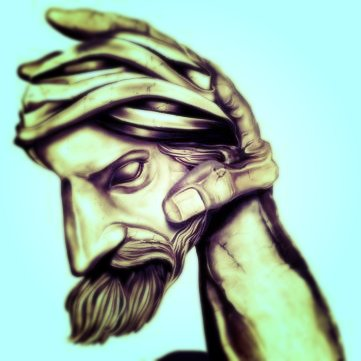

# Infographics-for-Multidisciplinary-Correlations

## Prefazione

Questo scritto diventerà sia una sorta di mio diario personale che un punto di riflessione, esponendo le mie idee sull'impatto che ha la musica nel mondo e nella sua ricerca e comprensione.

Lo scopo di questo scritto è quello di arrivare ad elaborare metodologia di composizione musicale del tutto orginali in grado di rappresentare una possibila rappresentazione del futuro della musica.
Prima di però addentrarci su queste metodologie inedite, è doveroso ripercorrere la storia della musica partendo da Pitagora fino ad arrivare a Schönberg.

## [CAP1] Musica Celeste

